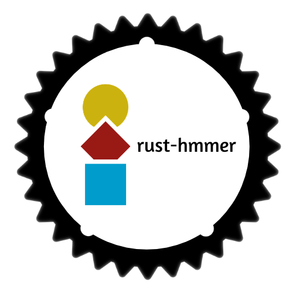

[](https://github.com/STRIDES-Codes/rust-hmmer/blob/master/LICENSE)
[](https://github.com/STRIDES-Codes/rust-hmmer/actions/workflows/security_audit.yml)

<p align="center">
    
</p> 

# rust-hmmer: a simple Rust parser for hmmer output files

This library aims to provide a Rust parser for hmmer output files.


## Requirements
- [Rust](https://rust-lang.org) in stable channel


## Development

To format code run:

```
cargo fmt
```

To test code run:

```
cargo test --all-features
```

To run all benchmarck use:

```
cargo bench --all-features
```

## Contributions
Contributions are welcomed under the project [code of conduct](https://github.com/Ebedthan/sabreur#code-of-conduct).

## Bugs
Submit problems or requests to the [Issue Tracker](https://github.com/Ebedthan/sabreur/issues).

## License
Licensed under the MIT license http://opensource.org/licenses/MIT. This project may not be copied, modified, or distributed except according to those terms.

## Code of conduct
Please note that the sabreur project is released with a [Contributor Code of Conduct](https://github.com/Ebedthan/sabreur/blob/main/CODE_OF_CONDUCT.md). By contributing to this project, you agree to abide by its terms.
